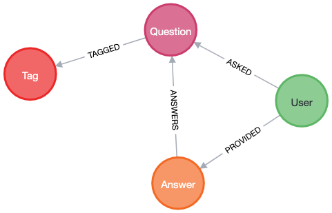

# Setup

Clear database:
```
MATCH (n) DETACH DELETE n
```

Load the file [movies.csv](./movies.csv) into the Import folder of the database.

# Tasks


***Task 1***

Count number of movies:
```
LOAD CSV WITH HEADERS FROM 'file:///movies.csv' AS csvLine
RETURN count(csvLine)
```

Output:
```
count(csvLine)
3
```

***Task 2***

Create the movies from this file:
```
LOAD CSV WITH HEADERS FROM 'file:///movies.csv' AS csvLine
MERGE (country:Country { name: csvLine.country })
CREATE (movie:Movie { id: toInteger(csvLine.id), title: csvLine.title, year:toInteger(csvLine.year)})
CREATE (movie)-[:MADE_IN]->(country)
```

We can verify that it has been imported by running:
```
MATCH (n:Movie)-[r:MADE_IN]->(c:Country)
RETURN n,r,c
```

Output:
```
╒═════════════════════════════════════════════════════════════╤══════════╤════════════════════════╕
│n                                                            │r         │c                       │
╞═════════════════════════════════════════════════════════════╪══════════╪════════════════════════╡
│(:Movie {year: 1987,id: 1,title: "Wall Street"})             │[:MADE_IN]│(:Country {name: "USA"})│
├─────────────────────────────────────────────────────────────┼──────────┼────────────────────────┤
│(:Movie {year: 1995,id: 2,title: "The American President"})  │[:MADE_IN]│(:Country {name: "USA"})│
├─────────────────────────────────────────────────────────────┼──────────┼────────────────────────┤
│(:Movie {year: 1994,id: 3,title: "The Shawshank Redemption"})│[:MADE_IN]│(:Country {name: "USA"})│
└─────────────────────────────────────────────────────────────┴──────────┴────────────────────────┘
```

***Task 3***

Import some Stackoverflow questions via the API and format them into 4 nodes and 4 relationships:


We can achieve this with the following code:
```
WITH "https://api.stackexchange.com/2.2/questions?pagesize=100&order=desc&sort=creation&tagged=neo4j&site=stackoverflow&filter=!5-i6Zw8Y)4W7vpy91PMYsKM-k9yzEsSC1_Uxlf" as url
CALL apoc.load.json(url) YIELD value
UNWIND value['items'] as item
    MERGE (question:Question {title: item["title"], content: item["body_markdown"], is_answered: item["is_answered"]})
    MERGE (user:User {id: item['owner']['user_id']})-[:ASKED]-(question)
    WITH item, question, [t in item['tags']] as tags
        UNWIND tags as tag
            MERGE (question)-[:TAGGED]->(t:Tag {tag: tag})
    WITH question, [a in item['answers']] as answers
        UNWIND answers as answer
            MERGE (a:Answer{id: answer['answer_id'], is_accepted: answer['is_accepted'], content: answer['body_markdown']})-[:ANSWERS]->(question)
            MERGE (u:User{id: answer["owner"]['user_id']})-[:PROVIDED]->(a)   
```

You can verify it by searching for the first question and then looking around it in the Neo4j Browser
```
MATCH (q:Question)
RETURN q LIMIT 1
```
